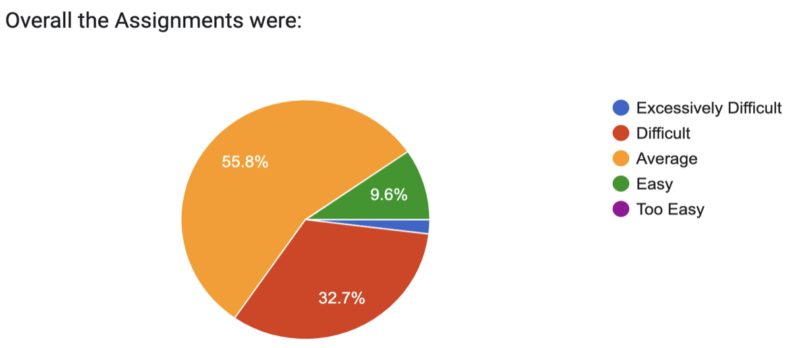
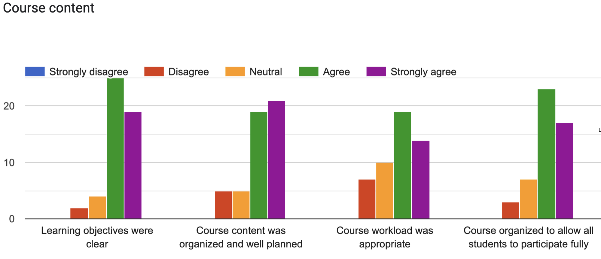
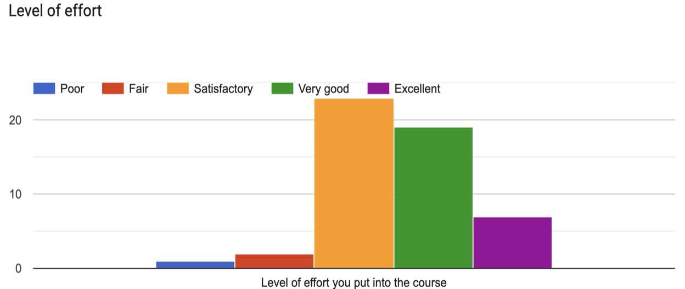
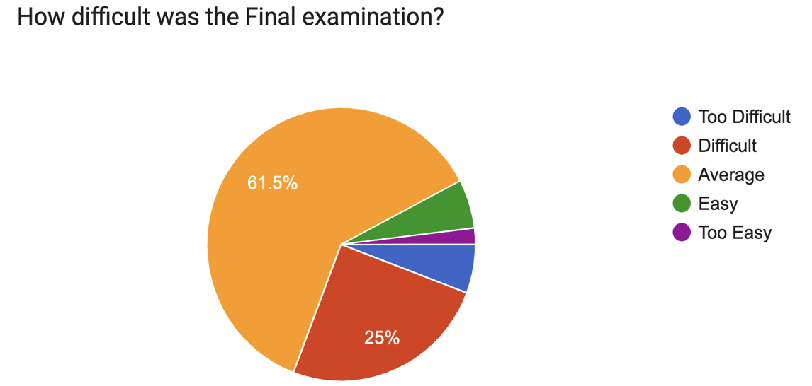

# About
{:.no_toc}

## Table of contents
{: .no_toc .text-delta }

1. TOC
{:toc}

---

## Course Description

Welcome to CS 598: Foundations of Data Curation! Data curation, a
critical activity within data science, is “the active and on-going management of data through its lifecycle of interest and usefulness to scholarship, science, and education; curation activities and policies enable data discovery and retrieval, maintain data quality and add value, and provide for re-use over time.” This course provides an overview of a broad range of theoretical and practical problems in the emerging field, examining issues related to data models, data integration, format conversion, authentication and integrity, identifiers, preservation, workflow, provenance, metadata, and legal and policy issues.

## Textbook
There is no required textbook for this course, but there are weekly required and optional
readings that can be found in each weekly overview page.

## Prerequisites
You should enter the course with basic programming skills and a working knowledge
of markup languages (HTML, XML etc.), Text encoding systems, relational databases and schema
design, which will be very helpful but not required.

## Course Expectations

The field of Data Science is a fast-moving, empirically driven research field. Learning about such a fast-moving field is an exciting opportunity but covering it in a traditional course setting comes with some caveats. There are very few high-quality Data Curation textbooks or other learning materials that synthesize or explain much of the content we will cover. In many cases the research paper that introduced an idea is the best or only resource for learning about it. Data exists in different forms and modalities which requires carefully developed curation methods. The focus of this course is not to teach a specific tool or language for data curation but instead help you recognize key challenges in management of data and develop effective strategies to tackle them.

## Course Statistics (Previous offering)

## Course Objectives

Upon successful completion of this course, you will:
- Recognize the significance of abstraction and indirection in data science, and be able to
promote data curation strategies based on these principles.
- Recognize how key data abstraction strategies are related to each other both at the same level
of abstraction and across levels of abstraction.
- Learn a framework of fundamental concepts of data representation.
- Recognize the common challenges in data integration, and how they can be addressed.
- Recognize the importance of workflow management and provenance documentation.
- Understand the trade-offs for common data preservation strategies.
- Recognize the complex problems with data set identity at different levels of abstraction and
be familiar with challenges in determining data and data representation identity.
- Understand the cross-cutting importance of metadata in data curation activities.
- Review recent empirical research on the information behavior of researchers and other profes-
sionals.
- Be familiar with the of significance of governance, policy, law, and ethics in data science.
- Recognize the different kinds of data standards, how they are related, and how they are
important to data science.

## Grade Policy

Grading is based on Assignments, Quizzes and Final Exam. Detailed grading scale
is provided in the Course Syllabus on Coursera. Each Graded Assessment typically carries 20%
weightage.

| Letter Grade | Percent Needed                 | Letter Grade | Percent Needed | Letter Grade | Percent Needed |
|--------------|--------------------------------|--------------|----------------|--------------|----------------|
| A+           | Instructor's Discretion        | B+           | 85%            | C            | 70%            |
| A            | 90%                            | B            | 80%            | D            | 60%            |
| A-           | 88%                            | B-           | 78%            | F            | Below 58%      |

## Grading

1. Assignments (19-20% each): There will be 4 mini project style assignments
2. Peer Review (1%): Some assignments are peer reviewed prior submitting to staff grading, 1%
grade is based on the average score assigned to you by your peers in the class.
3. Final exam (20%): The final exam will cover the entire semester

## Late Policy

Unless otherwise specified, all assignments are due at 11:59 PM US Central Time on the due date. Considering the large size of this class, we typically DO NOT accept any late assignments. We encourage everyone to finish the assignments before the deadline. Please
do not email the staff requesting to accept assignment with late penalty. In case of extenuating circumstances extensions are granted at the discretion of course staff. In such circumstances please reach out to TAs or post email to mcs-support@illinois.edu

## Academic Integrity

You are welcome to discuss assignments with your classmates, but do not
show or share any code. Also, you may not use any code from the Internet or any other outside
sources, unless it is specifically approved by the instructor. Be sure to acknowledge any help that you do get from other students or outside works, even if it’s just a small suggestion. Violations will go on record at the university, and the minimum penalty will be a zero for the entire assignment. Read Here These standards will be enforced and infractions of these rules will not be tolerated in this course. Sharing, copying, or providing any part of a homework solution or code is an infraction of the University’s rules on academic integrity. We will be actively looking for violations of this policy in homework submissions. Any violation will be punished as severely as possible with sanctions and penalties typically ranging from a failing grade on this assignment up to a failing grade in the course, including a letter of the offending infraction kept in the student’s permanent university
record. Again, a good rule of thumb: Keep every typed word and piece of code your own. If you
think you are operating in a gray area, you probably are. If you would like clarification on specifics, please contact the course staff.

## Disability Accommodations

Students with learning, physical, or other disabilities requiring
assistance should contact the instructor as soon as possible. If you’re unsure if this applies to you or think it may, please contact the instructor and Disability Resources and Educational Services(DRES) as soon as possible. You can contact DRES at 1207 S. Oak Street, Champaign, via phone at (217) 333-1970, or via email at disability@illinois.edu

## Mental Health
Significant stress, mood changes, excessive worry, substance/alcohol misuse or
interferences in eating or sleep can have an impact on academic performance, social development, and emotional wellbeing. The University of Illinois offers a variety of confidential services including individual and group counseling, crisis intervention, psychiatric services, and specialized screenings which are covered through the Student Health Fee. If you or someone you know experiences any of the above mental health concerns, it is strongly encouraged to contact or visit any of the University’s resources provided below. Getting help is a smart and courageous thing to do for yourself and for those who care about you.
- Counseling Center (217) 333-3704
- McKinley Health Center (217) 333-2700
- National Suicide Prevention Lifeline (800) 273-8255
- Rosecrance Crisis Line (217) 359-4141 (available 24/7, 365 days a year)
If you are in immediate danger call 911
